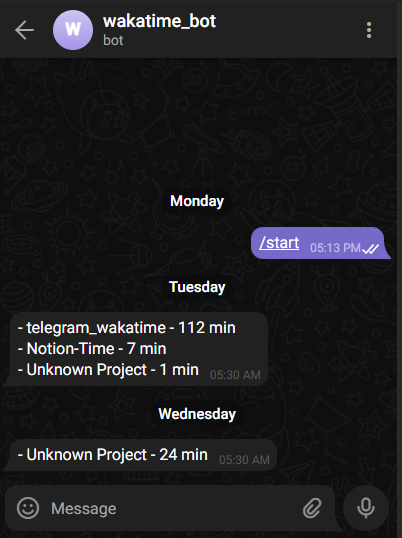

# Telegram Bot for Wakatime Project Progress

A ready to use AWS Lambda function that fetches **daily** project progress from Wakatime and posts to Telegram every 12 AM UTC.

## Setup instructions
1. Clone the project
2. rename the file [template-application.properties](src/main/resources/template-application.properties) to `application.properties` and set the values for Telegram and Wakatime properties.
   1. `wakatime.token` is the Base64 encoded value of the actual Wakatime Token that you can extract from its Dashboard
   2. `telegram.token` can be generated using `/newbot` command from BotFather in telegram
3. Run `mvn clean package shade:shade`
4. Deploy the `telegram_wakatime-1.0-SNAPSHOT-shaded.jar` JAR under an AWS Lambda function. (Note: You can take reference of [wakatime_telegram_bot.yaml](wakatime_telegram_bot.yaml) SAM file to create the Lambda function)

## Outcome

